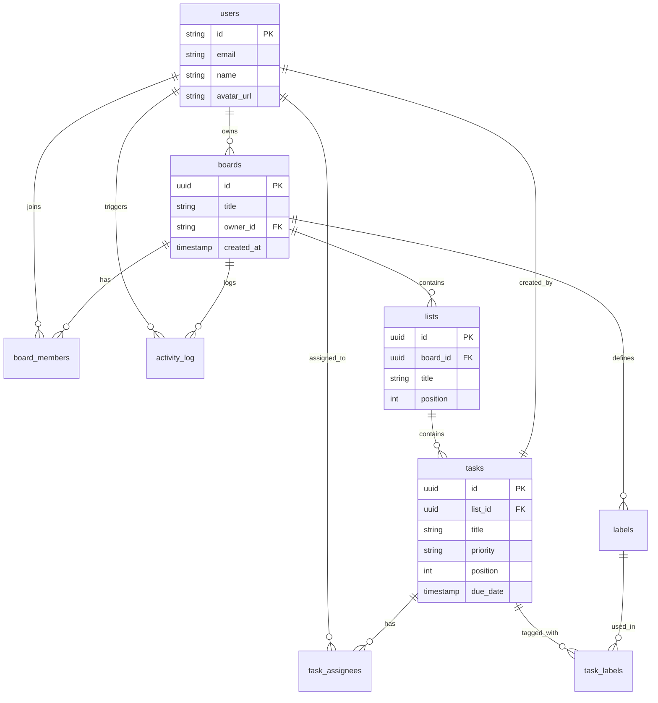

# Project Architecture & Deliverables

## 1. Frontend Architecture

The frontend is built using **Next.js 15+ (App Router)** with **React 19**, focusing on performance, SEO, and developer experience.

### Core Technologies
*   **Framework**: Next.js (App Router) for routing, server-side rendering, and static generation.
*   **Language**: TypeScript for type safety and developer productivity.
*   **Styling**: Tailwind CSS v4 for utility-first styling with a custom design system.
*   **UI Components**: Shadcn/ui (Radix Primitives) for accessible, customizable code-based components.
*   **State Management**:
    *   **Server State**: TanStack Query (React Query) for data fetching, caching, and optimistic updates.
    *   **Client State**: Zustand for global UI state (e.g., sidebar toggles, modal states).
    *   **URL State**: Search params for filter/sort/view persistence.
*   **Drag & Drop**: `@dnd-kit/core` for accessible, performant drag-and-drop interactions (Kanban board).

### Architectural Patterns
*   **Server Components vs. Client Components**: Heavy use of generic Server Components for initial data fetching and layout, with minimal Client Components for interactivity.
*   **Optimistic UI**: Immediate UI feedback on user actions (e.g., moving a task) before the server confirms, ensuring a "native app" feel.
*   **Feature-based Folders**: Code organization by feature (e.g., `components/board`, `components/task`) rather than just technical type.

---

## 2. Backend Architecture

The backend follows a **Serverless** architecture leveraging Next.js API Routes hosted on Vercel.

### Core Technologies
*   **Runtime**: Node.js (Serverless Functions).
*   **Database**: Neon (Serverless PostgreSQL) for scalable, branched database management.
*   **ORM**: Drizzle ORM for type-safe SQL queries and efficient schema management.
*   **Authentication**: Clerk for secure, managed user authentication and session management.

### Architectural Patterns
*   **Service Layer Pattern**: Business logic is encapsulated in "Services" (e.g., `BoardsService`, `TaskService`) rather than inside API route handlers. This promotes reusability and testability.
*   **Secure API Routes**: All API routes are protected via Clerk middleware and validate user permissions before execution.
*   **Edge Compatibility**: Designed to run efficiently in serverless/edge environments.

---

## 3. Database Schema

The database is normalized and designed for data integrity with appropriate indexing.



### Key Indices
*   `boards(owner_id)`: Fast lookup of user boards.
*   `lists(board_id, position)`: Efficient ordered retrieval of lists.
*   `tasks(list_id, position)`: Efficient ordered retrieval of tasks.

---

## 4. API Contract Design

The API follows **RESTful** principles with standard HTTP methods and status codes.

### Endpoints (Examples)

#### **Boards**
*   `GET /api/boards`: Fetch all boards for the current user.
*   `POST /api/boards`: Create a new board.
*   `GET /api/boards/:id`: Fetch specific board details (including lists and tasks).
*   `PATCH /api/boards/:id`: Update board metadata.
*   `DELETE /api/boards/:id`: Delete a board (cascade deletes lists/tasks).

#### **Lists**
*   `POST /api/lists`: Create a list within a board.
*   `PATCH /api/lists/:id/reorder`: Update list position (drag-and-drop sync).

#### **Tasks**
*   `POST /api/tasks`: Create a task.
*   `PATCH /api/tasks/:id`: Update task details (title, description, due date).
*   `PATCH /api/tasks/:id/move`: Move task between lists or reorder within a list.

### Response Format
Standard JSON response:
```json
{
  "data": { ... }, // On success
  "error": "Message" // On failure
}
```

---

## 5. Real-time Sync Strategy

To ensure a collaborative "real-time" experience without the complexity of full WebSockets initially, we employ a hybrid strategy:

1.  **Optimistic Updates (Immediate Feedback)**:
    *   When a user moves a card, the UI updates *instantly* via React Query `onMutate`.
    *   The API request is sent in the background.
    *   If the request fails, the UI rolls back to the previous state.

2.  **Short Polling / Revalidation**:
    *   **Current**: React Query creates a "near real-time" effect by revalidating queries on focus/mount and after mutations.
    *   **Future Upgrade**: We can implement **Server-Sent Events (SSE)** or use a lightweight WebSocket layer (like Pusher or Neon's Notify) to trigger cache invalidations (`queryClient.invalidateQueries`) instantly when other users make changes.

3.  **Conflict Resolution**:
    *   "Last Write Wins" strategy for simple field updates.
    *   List positions are handled using fractional indexing or robust integer spacing rebalances to minimize conflicts.

---

## 6. Scalability Considerations

### Database
*   **Connection Pooling**: Using Neon's connection pooling to handle thousands of concurrent serverless & edge connections without exhausting Postgres limits.
*   **Indexing**: Critical paths (board loading, task filtering) are optimized with B-tree indices on foreign keys and sorting columns.

### Backend
*   **Stateless**: API routes are stateless, allowing infinite horizontal scaling via Vercel's serverless infrastructure.
*   **Rate Limiting**: Implementation of generic rate limiting middleware to prevent abuse.

### Frontend
*   **Static Assets**: All JS/CSS/Images are served via CDN (Vercel Edge Network).
*   **Code Splitting**: Next.js automatically splits code by route, ensuring the initial load is minimal.
*   **Memoization**: Heavy UI components (like complex Kanban cards) are memoized to prevent unnecessary re-renders during high-frequency updates (e.g., dragging).

---

## 7. Assumptions and Trade-offs

### Assumptions
*   **Authentication**: We assume users will sign up via Clerk. The `owner_id` in the database is directly linked to Clerk's User ID.
*   **Single Tenant**: The current architecture assumes a single deployment instance. Multi-tenancy (team-based subdomains) would require schema changes.
*   **Device Support**: The UI is optimized for desktop and tablet usage (drag-and-drop), though responsive for mobile.

### Trade-offs
*   **Polling vs. WebSockets**:
    *   *Decision*: We used a "Hybrid Optimistic UI + Polling" strategy instead of full WebSockets for the MVP.
    *   *Pro*: Significantly lower complexity, easier to debug, works effortlessly in serverless (no persistent connections), lower cost.
    *   *Con*: Updates from *other* users might have a slight delay (1-2s) compared to millisecond-latency WebSockets.
*   **Client-Side Ordering**:
    *   *Decision*: Drag-and-drop ordering is calculated on the client and sent to the API.
    *   *Pro*: Instant feedback for the user.
    *   *Con*: Rare edge cases where two users reorder the same list simultaneously might require a refresh to sync.

---

## 8. Demo Access

The application is deployed and ready to use.

*   **Live URL**: [https://rtc-pi.vercel.app](https://rtc-pi.vercel.app)
*   **Test Credentials**: You can sign up with any email or Google account.
*   **GitHub Repository**: [https://github.com/uvenkatateja/RTC](https://github.com/uvenkatateja/RTC)

